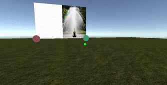

# Education

### MS Candidate in Industrial Engineering 
#### (Advanced Analytics Concentration)

University of Illinois at Urbana Champaign \\
December 2022 (Expected)

### BS in Bioengineering:

University of Illinois at Urbana Champaign \\
May 2017

---

# Work Experience

### Simulation Engineer, Healthcare Engineering Systems Center, University of Illinois at Urbana Champaign 

#### Aug 2019 – Present

- Leading multi-disciplinary teams to develop virtual reality projects for medical simulation and training.
- End-to-end project management including ideation, proposal writing, and production to deliver software.
- Managing $100,000+ in Jump Trading ARCHES funding for development.

---

# Portfolio

## Data Science and Machine Learning Projects

### Data Collection Portal for Pose Estimation

I am leading the development of a web portal where subjects can take images and videos and submit them for further analysis. We are developing this tool to be modular and scalable so researchers with various requirements can utilize it to collect data. As a an example, I have developed a portal that allows users to take a picture of their face. Upon submission, a deep learning model determines where key landmarks of the face are. Those landmarks are then drawn on the image and sent back to the user.

Check out the demo <a href="https://www.faciallandmarkdetector.com/">here</a>! (Not mobile friendly, yet. Please check on a computer.)
#### Technologies:
- Python
- Pytorch
- OpenCV
- Docker
- AWS
    - Lambda
    - S3
    - DynamoDB

---

### Implementing Machine Learning Algorithms from Scratch

For my Statistical Learning class, we focused on deeply understanding common machine learning algorithms. To do this, we had to code up various algorithms from scratch in Python. We coded KNN, linear regression, Lasso and ridge regression, SVMs, Linear/Quadratic Discriminant Analysis, kernel regression, and many more. We also implemented many useful machine learning techniques like k-fold cross validation, PCA, forward/backwards feature selection, AIC/BIC scoring for model evaluation, standardization, and confusion matricies. My Jupyter notebooks for all the classes are below:
- <a href="./html/HW2">KNN</a>
- <a href="./html/HW3">Simulations, Linear Regression, AIC, BIC, Model Selection</a>
- <a href="./html/HW4">Optimization, Cooridnate Descent, Feature Standardization</a>
- <a href="./html/HW5">Lasso, Pathwise Coordinate Descent</a>
- <a href="./html/HW6">Spline and Kernel Regression</a>
<!-- - <a href="./html/HW7">Local Linear Regression, Linear/Quadratic Discriminant Analysis</a> -->
- <a href="./html/HW8">SVM</a>
- <a href="./html/HW9">Kernel Ridge Regression</a>

The actual code can be found on my github <a href="https://github.com/harrisnisar/STAT542">here</a>.

---

### Caption Generator using Deep Learning

For my Deep Learning class, our final project involved building a caption generation system. We trained a encoder decoder deep learning model. The encoder was a CNN that took in images. After passing through the encoder, the output was resized and used as the first input to the decoder which was an LSTM to generate captions. Our training architecture is shown in the image below:

Read our final report <a href="./pdf/CS547_Project_Report.pdf">here</a>. \\
See our code <a href="https://github.com/harrisnisar/IE534/tree/main/Final%20Project%20-%20CaptionGeneration">here</a>.

---

### Urban Sound Tagging using Deep Learning

---

### Fashion MNIST Exploration and Model Building

---

## Virtual Reality (VR) Projects

### Joviality

Joviality delivers psychotherapy to patients suffering from serious/terminal illnesses with the help of VR. It is broken up into modules with the intent to teach users about the importance of emotional and mental wellbeing. This is a highly inter disciplinary project between software engineers, artists and sociologists. I have led the development of the software as well as developing pipelines that easily allow our team to work effectively. One of the cool features of our software is a completely gazed based interaction system to ensure easy access to patients who might be tethered to a hospital bed. We are also working on developing realistic non playable characters to guide the user through the curriculum.

#### Technologies:
- Unity3D
- Oculus Quest 2

#### Demo:

<iframe style="object-fit:cover" src="https://www.youtube.com/embed/T3pZm9tDSLA" title="YouTube video player" frameborder="0" allow="accelerometer; autoplay; clipboard-write; encrypted-media; gyroscope; picture-in-picture" allowfullscreen></iframe>

---

### Neonatal VR

I lead the development of a virtual reality software to train common procedures performed on neonates. One of those porceudres is umbilical venous catheterization (UVC). UVC is an emmergent procedure that involves inserting a catheter into a newborns umbilical stump through the umbilical vein. I take educational content from subject matter experts (neonatologists) and convert that to VR content. We develop realistic interactions to simulate the procedure to allow users to learn/review the steps of the procedure in an immersive manner. 

#### Technologies:
- Unity3D
- Oculus Quest 2

#### Demo:

The demonstration below is of the working prototype for this software. We hope to continue developing this prototype and to run a study to understand the efficacy of the software in teaching this content. 

<iframe width="360" height="200" src="https://www.youtube.com/embed/8yZYXFBrX0I" title="YouTube video player" frameborder="0" allow="accelerometer; autoplay; clipboard-write; encrypted-media; gyroscope; picture-in-picture" allowfullscreen></iframe>

---

### ECMO VR

ECMO VR is a virtual reality software to teach users about the complicated procedure of extracorpreal membrane oxygenation (ECMO). ECMO is a procedure performed when a patient has a failing lung and/or heart. Patients are hooked up to an external circuit to pump and oxygenate the blood. The software is designed to teach about the equipment involved in the proceudre, how to correctly connect the components depending on the patient's symptoms, and how to troubleshoot the circuit when faced with common issues. 

#### Technologies:
- Unity3D
- Oculus Quest 2

#### Machine Explorer Demo:

The demonstration below is showing a prototype of the machine exploration module. Users can grab various components off the cart and learn more about them. The components are realistically modeled and correctly placed on the ECMO cart to ensure a realistic delivery of education. 

<iframe width="360" height="200" src="https://www.youtube.com/embed/ggQRWBkMQBA" title="YouTube video player" frameborder="0" allow="accelerometer; autoplay; clipboard-write; encrypted-media; gyroscope; picture-in-picture" allowfullscreen></iframe>

---

### Cardio VR

#### Technologies:
- Unity3D
- Oculus Quest 2

<!-- ##### Machine Explorer:

<iframe width="560" height="315" src="https://www.youtube.com/embed/ggQRWBkMQBA" title="YouTube video player" frameborder="0" allow="accelerometer; autoplay; clipboard-write; encrypted-media; gyroscope; picture-in-picture" allowfullscreen></iframe> -->

---

### Spay VR

#### Technologies:
- Unity3D
- Oculus Quest 2

#### Tool Explorer and Surgical Incision:

<iframe width="360" height="200" src="https://www.youtube.com/embed/zMFY5ra44Ds" title="YouTube video player" frameborder="0" allow="accelerometer; autoplay; clipboard-write; encrypted-media; gyroscope; picture-in-picture" allowfullscreen></iframe>

#### Anatomy Viewer:

<iframe width="360" height="200" src="https://www.youtube.com/embed/rElz6Wt7tzI" title="YouTube video player" frameborder="0" allow="accelerometer; autoplay; clipboard-write; encrypted-media; gyroscope; picture-in-picture" allowfullscreen></iframe>

---

### Brain VR

<!-- ##### Machine Explorer:

<iframe width="560" height="315" src="https://www.youtube.com/embed/ggQRWBkMQBA" title="YouTube video player" frameborder="0" allow="accelerometer; autoplay; clipboard-write; encrypted-media; gyroscope; picture-in-picture" allowfullscreen></iframe> -->

---

### Road to Birth

<!-- ##### Machine Explorer:

<iframe width="560" height="315" src="https://www.youtube.com/embed/ggQRWBkMQBA" title="YouTube video player" frameborder="0" allow="accelerometer; autoplay; clipboard-write; encrypted-media; gyroscope; picture-in-picture" allowfullscreen></iframe> -->

---

### Intubation VR

<!-- ##### Machine Explorer:

<iframe width="560" height="315" src="https://www.youtube.com/embed/ggQRWBkMQBA" title="YouTube video player" frameborder="0" allow="accelerometer; autoplay; clipboard-write; encrypted-media; gyroscope; picture-in-picture" allowfullscreen></iframe> -->

---

## Hardware and IoT Projects

### UVBot

<!-- ##### Machine Explorer:

<iframe width="560" height="315" src="https://www.youtube.com/embed/ggQRWBkMQBA" title="YouTube video player" frameborder="0" allow="accelerometer; autoplay; clipboard-write; encrypted-media; gyroscope; picture-in-picture" allowfullscreen></iframe> -->

---

### Health Tracking Kiosk

<!-- ##### Machine Explorer:

<iframe width="560" height="315" src="https://www.youtube.com/embed/ggQRWBkMQBA" title="YouTube video player" frameborder="0" allow="accelerometer; autoplay; clipboard-write; encrypted-media; gyroscope; picture-in-picture" allowfullscreen></iframe> -->

---
