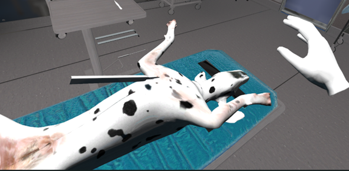
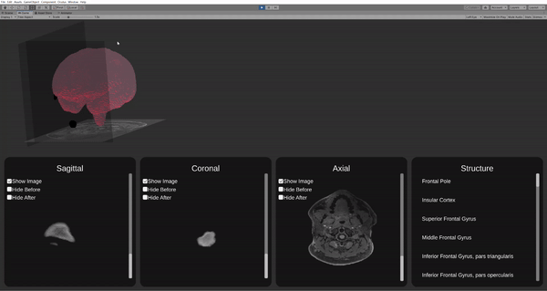
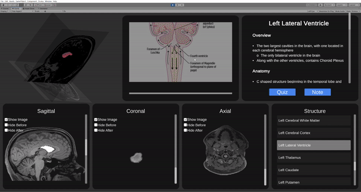
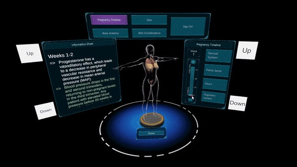
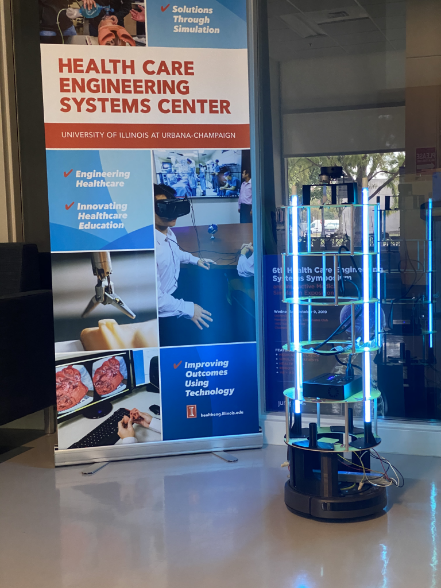

# Education

### MS Candidate in Industrial Engineering 
#### (Advanced Analytics Concentration)

University of Illinois at Urbana Champaign \\
December 2022 (Expected)

### BS in Bioengineering:

University of Illinois at Urbana Champaign \\
May 2017

---

# Work Experience

### Simulation Engineer, Healthcare Engineering Systems Center, University of Illinois at Urbana Champaign 

#### Aug 2019 – Present

- Leading multi-disciplinary teams to develop virtual reality projects for medical simulation and training.
- End-to-end project management including ideation, proposal writing, and production to deliver software.
- Managing $100,000+ in Jump Trading ARCHES funding for development.

---

# Projects

## Data Science and Machine Learning Projects

### Data Collection Portal for Pose Estimation

I am leading the development of a web portal where subjects can take images and videos and submit them for further analysis. We are developing this tool to be modular and scalable so researchers with various requirements can utilize it to collect data. As a an example, I have developed a portal that allows users to take a picture of their face. Upon submission, a deep learning model determines where key landmarks of the face are. Those landmarks are then drawn on the image and sent back to the user.

Check out the demo <a href="https://www.faciallandmarkdetector.com/">here</a>! (Not mobile friendly, yet. Please check on a computer.)
#### Technologies:
- React
- Python
- Pytorch
- OpenCV
- Docker
- AWS
    - Lambda
    - S3
    - DynamoDB

---

### Caption Generator using Deep Learning

For my Deep Learning class, our final project involved building a caption generation system. We trained a encoder decoder deep learning model. The encoder was a CNN that took in images. After passing through the encoder, the output was resized and used as the first input to the decoder which was an LSTM to generate captions. Our training architecture is shown in the image below:

Read our final report <a href="./pdf/CS547_Project_Report.pdf">here</a>. \\
See our code <a href="https://github.com/harrisnisar/IE534/tree/main/Final%20Project%20-%20CaptionGeneration">here</a>.

---

### Urban Sound Tagging using Deep Learning

For my Machine Learning and Signal Processing course, our final project explored training machine/deep learning algorithms to understand and interpret sounds. We used a dataset of audio recordings that have been obtained by placing sensors throughout New York City. Along with the sensor data, each sensor also records the timestamp and location of the recording. This dataset contains coarse and fine labels. Coarse labels tell us if any of the 8 coarse classes of sound are present. Fine labels further define these coarse labels by splitting them into more specific groups. We implemented a baseline system used in classifying this dataset that uses a pretrained network to extract features which were uses to trained a 1-layer neural network. Then we analyzed the effect of modifying 2 aspects of the baseline: (1) Transfer Learning and (2) Data Augmentation. In addition, we explore the use of simpler models like support vector machines (SVM). 

Read our final report <a href="./pdf/CS598PS_project.pdf">here</a>. \\
See our code <a href="https://github.com/harrisnisar/IE534/tree/main/Final%20Project%20-%20CaptionGeneration">here</a>.
---

### Implementing Machine Learning Algorithms from Scratch

For my Statistical Learning class, we implemented various algorithms from scratch in Python including KNN, linear regression, Lasso and ridge regression, SVMs, Linear/Quadratic Discriminant Analysis, kernel regression, and many more. We also implemented many useful machine learning techniques like k-fold cross validation, hyperparameter tuning, PCA, forward/backwards feature selection, AIC/BIC scoring for model evaluation, standardization, and confusion matricies. My Jupyter notebooks for all the classes are below:
- <a href="./html/HW2">KNN</a>
- <a href="./html/HW3">Simulations, Linear Regression, AIC, BIC, Model Selection</a>
- <a href="./html/HW4">Optimization, Cooridnate Descent, Feature Standardization</a>
- <a href="./html/HW5">Lasso, Pathwise Coordinate Descent</a>
- <a href="./html/HW6">Spline and Kernel Regression</a>
- <a href="./html/HW7">Local Linear Regression, Linear/Quadratic Discriminant Analysis</a>
- <a href="./html/HW8">SVM</a>
- <a href="./html/HW9">Kernel Ridge Regression</a>

The actual code can be found on my GitHub <a href="https://github.com/harrisnisar/STAT542">here</a>.

---

### Fashion MNIST Exploration and Model Building

For my Statistical Learning class, our final project asked us to solve image classification tasks (without deep learning, so no CNNs). For this project we are given the Fashion MNIST data to predict the class label in the testing data [3]. The dataset we are working with contains 70,000 28x28 images of 10 different categories of clothing where 60,000 are placed in the training dataset and the remaining 10,000 are used for the testing data. After exploring the data, we realized that since there are a lot of features, we should compress the data using PCA to find the most relevant combination of features. After this, we explored classification performance using several classical machine learning algorithms such as:
- KNN
- Light GBM
- Logistic Regression
We tuned the hyperparameters of these methods using k-fold cross validation. We also explored ensamble methods by stacking some of the classifiers we trained to see if we can imporve performance. 

Read our final report <a href="./pdf/Stat_542_Final_Project.pdf">here</a>. \\
See our code <a href="https://github.com/harrisnisar/IE534/tree/main/Final%20Project%20-%20CaptionGeneration">here</a>.

---

## Virtual Reality (VR) Projects

### Joviality
Joviality delivers psychotherapy to patients suffering from serious/terminal illnesses with the help of VR. It is broken up into modules with the intent to teach users about the importance of emotional and mental wellbeing. This is a highly inter disciplinary project between software engineers, artists and sociologists. I have led the development of the software as well as developing pipelines that easily allow our team to work effectively. One of the cool features of our software is a completely gazed based interaction system to ensure easy access to patients who might be tethered to a hospital bed. We are also working on developing realistic non playable characters to guide the user through the curriculum.\\

#### Some Gifs of the First Prototypes

#### Technologies:
- Unity3D
- Oculus Quest 2

#### Demo:
This demonstration is an end to end demo of the first module of the software:

<iframe style="width:100%;height:300px" src="https://www.youtube.com/embed/T3pZm9tDSLA" title="YouTube video player" frameborder="0" allow="accelerometer; autoplay; clipboard-write; encrypted-media; gyroscope; picture-in-picture" allowfullscreen></iframe>

---

### Neonatal VR

I lead the development of a virtual reality software to train common procedures performed on neonates. One of those porceudres is umbilical venous catheterization (UVC). UVC is an emmergent procedure that involves inserting a catheter into a newborns umbilical stump through the umbilical vein. I take educational content from subject matter experts (neonatologists) and convert that to VR content. We develop realistic interactions to simulate the procedure to allow users to learn/review the steps of the procedure in an immersive manner. 

#### Technologies:
- Unity3D
- Oculus Quest 2

#### Demo:

The demonstration below is of the working prototype for this software. We hope to continue developing this prototype and to run a study to understand the efficacy of the software in teaching this content. 

<iframe style="width:100%;height:300px" src="https://www.youtube.com/embed/8yZYXFBrX0I" title="YouTube video player" frameborder="0" allow="accelerometer; autoplay; clipboard-write; encrypted-media; gyroscope; picture-in-picture" allowfullscreen></iframe>

---

### ECMO VR

ECMO VR is a virtual reality software to teach users about the complicated procedure of extracorpreal membrane oxygenation (ECMO). ECMO is a procedure performed when a patient has a failing lung and/or heart. Patients are hooked up to an external circuit to pump and oxygenate the blood. The software is designed to teach about the equipment involved in the proceudre, how to correctly connect the components depending on the patient's symptoms, and how to troubleshoot the circuit when faced with common issues. 

#### Technologies:
- Unity3D
- Oculus Quest 2

#### Machine Explorer Demo:

The demonstration below is showing a prototype of the machine exploration module. Users can grab various components off the cart and learn more about them. The components are realistically modeled and correctly placed on the ECMO cart to ensure a realistic delivery of education. 

<iframe style="width:100%;height:300px" src="https://www.youtube.com/embed/ggQRWBkMQBA" title="YouTube video player" frameborder="0" allow="accelerometer; autoplay; clipboard-write; encrypted-media; gyroscope; picture-in-picture" allowfullscreen></iframe>

<!-- ---

### Cardio VR

#### Technologies:
- Unity3D
- Oculus Quest 2

<!-- ##### Machine Explorer:

<iframe width="560" height="315" src="https://www.youtube.com/embed/ggQRWBkMQBA" title="YouTube video player" frameborder="0" allow="accelerometer; autoplay; clipboard-write; encrypted-media; gyroscope; picture-in-picture" allowfullscreen></iframe> --> -->

---

### Spay VR

Spaying is a procedure performed on female dogs to remove their ovaries. It is the most common procedure performed by vets, therefore having good training is crucial. Spay VR is a project I work on in collaboration with the UIUC School of Vetmed. We are working on developing interactive, 3D content that can be delivered with a virtual reality headset or on the web to teach about the spay procedure. I help develop the software. So far we have developed an anatomical viewer for a dog and a tools module to explore the functions of various surgical tools. 

#### Technologies:
- Unity3D
- Oculus Quest 2

#### Tool Explorer and Surgical Incision:

The demo below showcases the various tools imported into VR. I have also included correct handholds so users can learn how the tools are supposed to be held. The scalpel can also be ussed to create an incision along the dog's abdomen.

<iframe style="width:100%;height:300px" src="https://www.youtube.com/embed/zMFY5ra44Ds" title="YouTube video player" frameborder="0" allow="accelerometer; autoplay; clipboard-write; encrypted-media; gyroscope; picture-in-picture" allowfullscreen></iframe>

#### Anatomy Viewer:

The demo below showcases the anatomy viewer I helped develop. The dog can be viewed at from any angle. Different crucial pieces of anatomy can be highlighted. Educators can save critical views to use as a teaching tool. 

<iframe style="width:100%;height:300px" src="https://www.youtube.com/embed/rElz6Wt7tzI" title="YouTube video player" frameborder="0" allow="accelerometer; autoplay; clipboard-write; encrypted-media; gyroscope; picture-in-picture" allowfullscreen></iframe>

---

### Brain VR

The goal of this project is to generate an app accessible on VR, tablet, and computer that allows students to visually dissect a human brain generated from post-mortem brain slices. The app will have visually linked MRI, post-mortem, and 3D reconstruction models so that the student can manipulate and view the effects in either image. In addition, the app will have educational content that will be dependent on the structure(s) selected.

#### Technologies:
- Unity3D

---

### Road to Birth

Road to Birth is an app for teaching anatomic and physiologic changes during pregnancy. Traditional approaches to teaching pre-clinical obstetrics understate its dynamic nature. To address this issue, we developed an app, “Road to Birth” (RtB), which was available in two formats: Virtual Reality (VR) and tablet. This app was made in collaboration with the University of Newcastle in New Zealand. I received the codebase and Unity project from them and added many features to allow for the deployment of this app. Namely, I added support for storing data and results in a cloud database, added quiz functionalities and added methods of tracking which parts of the app a student spent the most time on. In addition, I also tracked if a student preferred to use the VR version or tablet version of the app. The most challenging part of this process from a software engineering standpoint was implementing an efficient and easy way to deploy the app on students devices and maintain the VR versions in our VR lab. In particular, the iOS version was challenging because we could not just put the app on the app store because we wanted to keep the technology internal. To resolve this, we leveraged the University's Enterprise iOS Developer account and generated a version of the app that students could download without going through the app store. We hosted the file on our own server. Not only did I learn a lot about software development, but it was cool to actually work through deploying a piece of software.

#### Technologies:
- Unity3D

---

### Intubation VR

The goal of this project was to create a virtual reality simulation to teach medical professionals about the intubation procedure. Intubations are performed when someone has a compromised airway to open it up and allow the patient to breathe again. It is a highly stressful procedure. We have built an end to end tool to teach this procedure and allow learners to practice the procedure in a low risk setting. I was put on this project after a prototype had been developed and worked to rewrite the entire codebase in a more modular and scalable manner, relying largely on Unity’s event system.

#### Technologies:
- Unity3D
- VRTK

---

## Hardware and IoT Projects

### UVBot

UVBot is a low-cost robot that can be programmed to clean spaces such as schools, offices, and public transportation to inactivate COVID-19 with UV light. It promises 99% virus inactivation and can be controlled over Wi-Fi or Bluetooth to prevent UV exposure. The UVBot can be made from a Roomba robot, UV lamp, and 3D-printed parts. I helped lead the mechanical design and circuit design of the robot. We used FDM 3D printing and laser cutting to manufacture custom parts that were attached using off the shelf material. We used an off the shelf power supply and a ballast to safely power the UV lamps. A Raspberry Pi was used as a controller. 

Hear my presentation about how we designed the robot <a href="https://mediaspace.illinois.edu/media/t/1_u3begcyr">here</a>. 

#### Technologies/Skills:
- 3D modeling using Solidworks
- 3D fabrication using FDM printing and laser cutting

​---

### Self-Tracking Kiosk

The Self-Tracking Kiosk can be placed at entrances of buildings and office spaces to obtain the vitals of employees in a non-contact manner. The system is built around the UTi165K Forward Looking Infrared (FLIR) thermal camera. Since the UTi165K is calibrated is calibrated to work in the 30˚C~45˚C / 86˚F~113˚ F range with 0.5˚C / 1˚ F accuracy, it is excellent for human temperature & fever detection. Additionally, the UTi165K can stream data in real-time to a computer over USB. In order to interact with the kiosk, a mobile application has been developed to connect any smartphone to a kiosk via Bluetooth Low Energy (BLE) by scanning a QR code. Users can sign up for this application using their email or Gmail account. Gmail integration allows easy sign up for students at the University of Illinois at Urbana-Champaign because it follows the 2 factor authentication pattern students are familiar with. After this connection has been established, temperature readings can be pulled from the kiosk into the mobile application, where it is processed. A server has also been developed to store temperature information to monitor health over time. This server is designed to store information per user or per kiosk. As the system has been developed to be sensor agnostic, we can easily swap or add sensors based on the requirements of the user.

#### Technologies:
- Flutter for mobile app development
- Node for backend development
- MongoDB
- Firebase
- Python for reading sensor information and BLE server development

##### Demo:

The demo below shows the end to end process of connecting with the kiosk, reading the temperature to the raspberry pi, and sending the information to the mobile application.

<iframe style="width:100%;height:300px" src="https://www.youtube.com/embed/yzRbU7M6pbo" title="YouTube video player" frameborder="0" allow="accelerometer; autoplay; clipboard-write; encrypted-media; gyroscope; picture-in-picture" allowfullscreen></iframe>

---

# Publications
- Naveen Sankaran, Harris J Nisar “Efficacy Study on Interactive Mixed Reality (IMR) Software with Sepsis Prevention Medical Education” IEEE Virtual Reality, Osaka, Japan, March 25-27, 2019
- Lydia Lee, Harris J Nisar “Face and Content Validation of Food Safety Training in Virtual Reality (VR)” IEEE SeGAH (UNDER FINAL REVIEW)

# Course Work
- Deep Learning 
- Machine Learning
- Signal Processing
- Machine Learning for Signal Processing
- Algorithms for Data Analysis
- Advanced Data Analysis